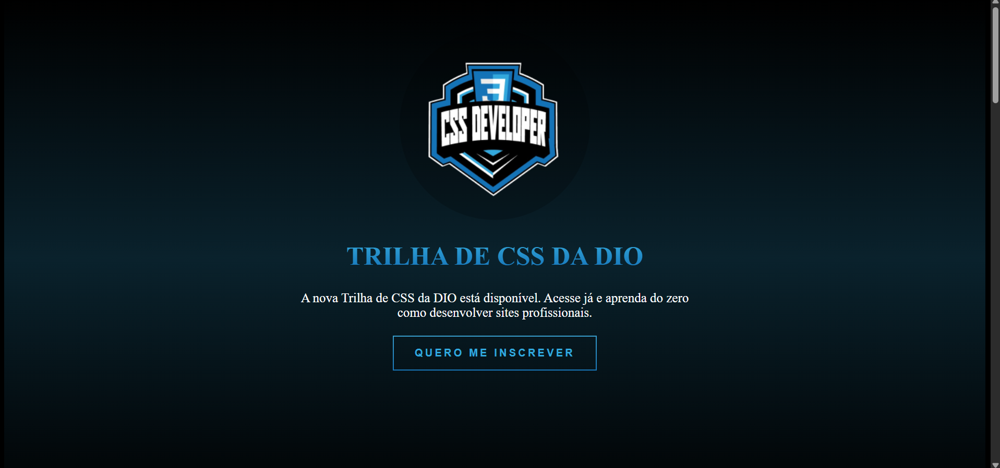

# 🎓 Replica do Site da DIO – Trilha CSS

Projeto front-end desenvolvido com **HTML5** e **CSS3**, com o objetivo de **replicar a interface do site da DIO (Digital Innovation One)**, focando na **Trilha de CSS**.

O projeto foi desenvolvido como parte de um curso prático, com foco em **estruturação de layout**, **estilização**, **responsividade** e boas práticas de CSS.

---

## 🌐 Deploy do Projeto

🔗 Acesse o projeto online:  
https://site-dio-inscri.vercel.app/

---

## 📸 Preview do Projeto



---

## 🚀 Funcionalidades

- Replica visual da página de inscrição da DIO
- Estruturação de seções informativas
- Layout responsivo
- Organização de conteúdo em blocos
- Estilização seguindo identidade visual semelhante ao site original
- Interface limpa e moderna

---

## 🎯 Objetivo do Projeto

Este projeto foi desenvolvido com o objetivo de praticar e consolidar:

- Estruturação semântica com **HTML5**
- Estilização com **CSS3**
- Organização de layouts modernos
- Responsividade e adaptação para diferentes telas
- Construção de interfaces inspiradas em aplicações reais
- Leitura e reprodução de design existente

---

## 🛠️ Tecnologias Utilizadas

- **HTML5**
- **CSS3**
- **Git & GitHub**
- **Vercel** (Deploy)

---

## 📂 Estrutura do Projeto

```bash
.
├── assets/
│   └── images/
│       └── Screen.png
├── css/
│   └── style.css
├── index.html
└── README.md
